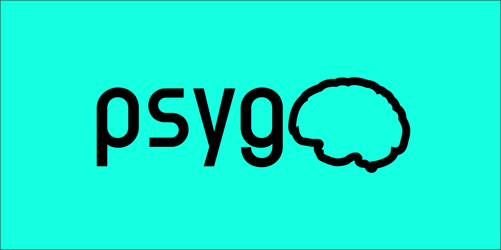

<h1> psygo 🧠 </h1>



The easiest way to get started creating plugins for online behavioural experiments! psygo is a CLI tool that streamlines the development of custom jsPsych plugins. by allowing you to test your experiment locally, with the (future) ability to export the experiment for local administration or administration via the jsPsych-friendly Gorilla platform. All the hard work is done for you, from setting up a project, to preparing it for administration.


[](https://github.com/henry-burgess/psygo/stargazers)


## Requirements & Installation

psygo requires Node.js v14+, available [here](https://nodejs.org/). Once Node.js has been installed, psygo can be installed using `npm`.

```shell
npm install -g psygo
```

## Usage

### Creating a new plugin

To create a new plugin, open a terminal and call:
```shell
psygo create
```
You will then be prompted for a plugin name. After providing a plugin name, psygo will create a new sub-directory with the following structure:

```
    ./<plugin-name>/
      |-- assets/
      |-- src/
            |-- main.js
            |-- classes.js
            |-- plugin.js
      |-- psygo.config.json
```

*src/main.js*: Constructs the timeline of jsPsych. Also contains the `jsPsych.init( ... );` function call.

*src/classes.js*: An optional file that should contain any additional classes or functions you wish to define outside `main.js`.

*src/plugin.js*: The core plugin file that contains the plugin pre-amble described in the jsPsych documentation, trial parameters, and the `plugin.trial` function.

*psygo.config.js*: Configuration file for psygo. Used in the export process.

*assets/*: A dedicated folder for placing graphics in.

### Configuration files

The configuration of the project is handled in `psygo.config.json`. The sample configuration looks similar to the following:
```json
{
    "name": "Experiment Name",
    "description": "Description of your experiment.",
    "libraries": [
          { "src": "two.js" }
    ],
    "files": [
        { "src": "main.js" },
        { "src": "classes.js" },
        { "src": "plugin.js" }
    ]
}
```

#### Libraries
Define externally-obtained dependencies such as existing libraries etc. The format of these entries are the same as Files: `{ "src": "<filename>" }`.

#### Files
Define local dependencies such as `main.js`, `classes.js`, and the jsPsych plugin file `plugin.js`. The format of these entries is: `{ "src": "<filename>" }`.

### Start

To test the plugin locally, open a terminal, navigate to a folder containing all the plugin files and `psygo.config.js` and call:
```shell
psygo start
```

This will update the directory structure of your project to the following:
```
    ./<plugin-name>/
      |-- assets/
      |-- local/
            |-- js/
                  |-- jspsych/...
                  |-- classes.js
                  |-- main.js
                  |-- plugin.js
            |-- index.html
      |-- src/
            |-- main.js
            |-- classes.js
            |-- plugin.js
      |-- psygo.config.json
```

All files in the `local` directory are then served and allows you to try out your plugin!